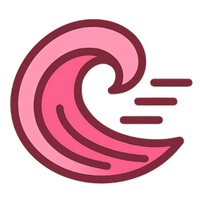

<h1 align="center">Kaho</h1>

<p align="center"></p>

<p align="center">A <b>Rust-based</b> library for interacting with Stoat.</p>

<p align="center">
<a href="https://kaho.2rkf.fun/docs/getting-started" target="_blank">Getting Started</a> · <a href="https://kaho.2rkf.fun/docs/examples" target="_blank">Examples</a> · <a href="https://stt.gg/g65YG8CA" target="_blank">Stoat</a>
</p>

> [!WARNING]
> This library is heavily under development. Bugs are expected.

## Installation

Kaho supports a MSRV of **Rust 1.76 or later**.

```toml
# Add crate to your Cargo.toml
[dependencies]
kaho = "*"
tokio = { version = "*", features = ["macros", "rt-multi-thread"] }
```

## Ping Pong Example

```rs
use kaho::{
    client::{KahoClient, KahoClientBuilder},
    models::{GatewayEvent, MessageSend},
    KahoResult,
};
use std::sync::Arc;
use tracing::{error, warn};

async fn handle_event(event: GatewayEvent, client: Arc<KahoClient>) {
    match event {
        GatewayEvent::Ready => {
            if let Ok(user) = client.http.fetch_self().await {
                println!("{}#{} is Ready!", user.username, user.discriminator);
            }
        }
        GatewayEvent::Message(message) => {
            let content = message.content.to_string();

            if content == "!ping" {
                let payload = MessageSend {
                    content: "Pong!".to_string(),
                    ..Default::default()
                };

                if let Err(e) = client.http.send_message(&message.channel, payload).await {
                    error!("Failed to send message: {}", e);
                }
            }
        }
        _ => {}
    }
}

#[tokio::main]
async fn main() -> KahoResult<()> {
    tracing_subscriber::fmt::init();

    let token = "STOAT_TOKEN";

    let mut client = KahoClientBuilder::new().
        token(token)
        .build()?;

    client.connect().await?;

    let client = Arc::new(client);

    let mut event_stream = client.gateway.events();

    while let Some(item) = event_stream.next().await {
        match item {
            Ok(event) => {
                let client = Arc::clone(&client);
                tokio::spawn(async move {
                    handle_event(event, client).await;
                });
            }
            Err(e) => {
                warn!(error = ?e, "Failed to receive event");
            }
        }
    }

    Ok(())
}
```

## License

Please refer to the [LICENSE](https://github.com/reinacchi/kaho/blob/master/LICENSE) file.
